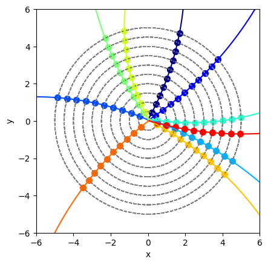
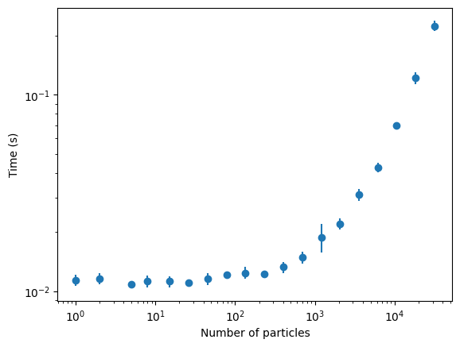

# ToyTrack

ToyTrack is a Python library for generating toy tracking events for particle physics. 

**The goal**: To produce a "*good-enough*" event simulation, in as few lines as possible (currently 3 lines), as quickly as possible (currently 0.15 seconds for a 10,000-particle event).

## Installation

Use the package manager [pip](https://pip.pypa.io/en/stable/) to install ToyTrack.

```bash
pip install toytrack
```

## Usage
```python
from toytrack import ParticleGun, Detector, EventGenerator

# Initialize a particle gun which samples uniformly from pt between 10 and 20 GeV, 
# initial direction phi between -pi and pi, and creation vertex vx and vy between -0.1 and 0.1 cm
particle_gun = ParticleGun(dimension=2, pt=(2, 20), pphi=(-np.pi, np.pi), vx=(-0.1, 0.1), vy=(-0.1, 0.1))

# Initialize a detector
detector = Detector(dimension=2).add_from_template('barrel', min_radius=0.5, max_radius=3, number_of_layers=10)

# Initialize an event generator, which generates an event with a number of particles given by a normal
# distribution, with mean 10 and standard deviation 5
event = EventGenerator(particle_gun, detector, num_particles=(20, 5, 'normal')).generate_event()

# Access the particles and hits as needed
particles = event.particles
hits = event.hits
```




## Performance

ToyTrack is designed to be fast. The following benchmarks were performed on a 64-core AMD EPYC 7763 (Milan) CPU. 

